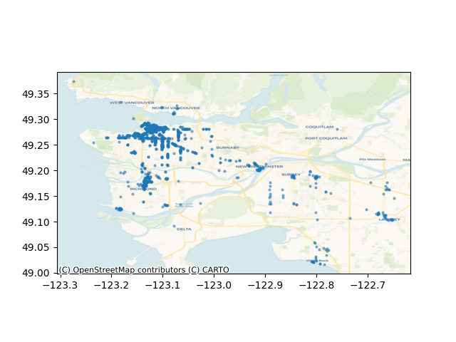

# Vancouver Yelp Restaurants Rating Analysis

##### October 2020

## Are there biases in Yelp ratings for restaurants in Vancouver with different socioeconomic statuses?

**Vancouver Restaurants for the Analysis**

This map plots the locations of the restaurants used in this analysis. I analyzed 3000 restaurants in the Metro Vancouver area across 132 categories.

**Distribution of Vancouver Restaurants by Rating on Yelp**

This graph plots the distribution of restaurants on a 0.5 scale. The x-axis is the restaurant rating, with 5 being the highest. The y-axis is the numbers of restaurants for that rating. This graph suggestions that the ratings are normally distributed, with a rating of 4 being the most common.

Distribution of Vancouver Restaurants by Household I