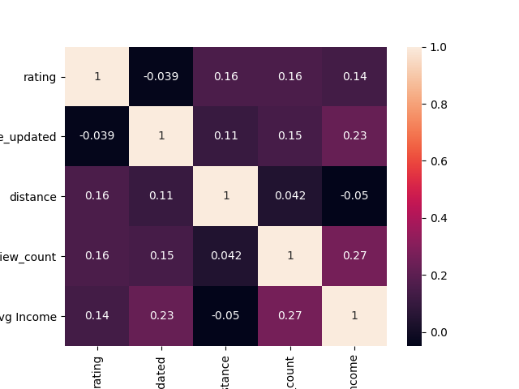

# Vancouver Yelp Restaurants Rating Analysis

## Are there biases in Yelp ratings for restaurants in Vancouver with different socioeconomic statuses?

#### Vancouver Restaurants for the Analysis

This map plots the locations of the restaurants used in this analysis. I analyzed 3000 restaurants in the Metro Vancouver area across 132 categories.

#### Distribution of Vancouver Restaurants by Rating on Yelp

This graph plots the distribution of restaurants on a 0.5 scale. The x-axis is the restaurant rating, with 5 being the highest. The y-axis is the numbers of restaurants for that rating. This graph suggests that the ratings are normally distributed, with a rating of 4 being the most common.

#### Distribution of Vancouver Restaurants by Average Income

The violin plot shows the distribution of average income at specfiic ratings. It looks like the median point of average income trends lower (around $40k) for low ratings (2.5, 3.0, and 3.5), while it trends relatively higher (around $80k) for high ratings (4.0 and 4.5).

## Are there biases in Yelp ratings for restaurants in Vancouver with different socioeconomic statuses?

The data on restaurants was divided by socioeconomic status, based on average income. Average income is defined as total income divided by total respondents in the corresponding federal electoral district. This breakdown was conducted relative to Vancouver income standards, with the cut offs listed below.

1. Low (=1) < $45,000
2. Medium (=2) >= $45,000 and <= $65,000
3. High (=3) >$65,000

There are 42 electoral districts in BC. The restaurants in our dataset are concentrated in 11. In the image above, the majority of restaurants are located downtown (Vancouver Centre). Other electoral districts include Vancouver East, Vancouver Granville, and Vancouver Kingsway.

This graph plots the distribution of restaurants by review, grouped by socioeconomic level. The x-axis shows the average price of the restaurant, with 1 indicating a cheap restaurant ($) and 4 indicating an expensive restaurant ($$$$). 

This shows that the majority of restaurants with a 1 rating are from a low socioeconomic neighbourhood. This price level also has the fewest number of restaurants. 

The majority of restaurants are medium priced (have a rating of 2). 

Expensive price levels (3 and 4) are dominated by restaurants in high socioeconomic neighbourhoods. 

## Features

To investigate restaurants in various socioeconomic neighbourhoods, I trained a regression model using several features. To do this, I looked at the correlation between variables to see which ones had a strong correlation with rating. Our dataset has a few factors relating to restaurant quality. 

None of them have a strong correlation with rating individually. This makes sense because it is inherently the combination of variables the dictates a restaurant's quality (a low price does not necessarily suggest a low rating). 

- **Rating (integer)**: the restaurant's average rating, as determined by Yelp users. Possible scores range from from 1 to 5

- **Review Count (integer)**: the restaurant's total reviews given by Yelp users

- **Price (integer)**: the restaurant's average price, as determined by Yelp users. Possible scored range from $ to $$$$

- **distance (integer)**: the restaurant's distance in meters from the city centre, around Olympic Village. Note that this was not used as a training variable as there is a high variation in distances between low and high socioeconomic areas.

## Classes

My SVM model predicts for two classes, 0 and 1.

- 0 is a "bad" restaurant, meaning a rating <4
- 1 is a "good" restaurant, meaning a rating >= 4

This was done arbitrarily, but generally most restaurants are deemed "good" if they have a rating of 4 or higher.

## SVM Regression Model

To test for a bias, I trained two regression models:
- restaurants in a high socioeconomic neighbourhood
- restaurants in a low socioeconomic neighbourhood

For prediction, I put the restaurants in the opposing socioeconomic neighbourhood
- low socioeconomic restaurants tested in high socioeconomic model
- high socioeconomic restaurants tested in low socioeconomic model

Next, I built a Support Vector Graph for each model. By looking at the results, I can evaluate how a restaurant would perform in a different socioeconoic environment.

#### High Socioeconomic Restaurants in a Low Socioeconomic model

This model is trained on features from restaurants in a low socioeconomic neighbourhood. When testing it on high socioeconomic restaurants, it classifies half of them as "bad" restaurants. Generally, the model defines this as low review count and high price.

| n=613       | Predicted: 0 | Predicted: 1 |
| :---------- | :----------: | -----------: |
|  Actual: 0  | 143          | 51           |
|  Actual: 1  | 274          | 145       \  |

Approximately 68% had negative results, and 32% had positive results.

#### Low Socioeconomic Restaurants in a High Socioeconomic model

This model is trained on features from restaurants in a high socioeconomic neighbourhood. When testing it on low socioeconomic restaurants, it classifies every single one of the restaurants as "good".

| n=343       | Predicted: 0 | Predicted: 1 |
| :---------- | :----------: | -----------: |
|  Actual: 0  | 0            | 176          |
|  Actual: 1  | 0            | 167       \  |

Results were positive 100% of the time.

#### Controlling for Restaurant Type

To further investigate the bias, I ran the same models on all Starbucks in Metro Vancouver to hold the restaurant type constant. There are 271 Starbucks in the dataset. Starbucks was chosen because of the high sample size. For this model, I categorized a "good" Starbucks as one with a rating >= 3.5, as Starbucks average a 3.0 or 3.5 in rating.

Low Socioeconomic model

| n=109       | Predicted: 0 | Predicted: 1 |
| :---------- | :----------: | -----------: |
|  Actual: 0  | 0            | 20           |
|  Actual: 1  | 0            | 89        \  |

High Socioeconomic model

| n=63        | Predicted: 0 | Predicted: 1 |
| :---------- | :----------: | -----------: |
|  Actual: 0  | 0            | 12           |
|  Actual: 1  | 0            | 51        \  |

Both models predicted a positive result 100% of the time. In the high socioeconomic model, you can visually observe that several Starbucks locations' ratings are being overestimated.

## Conclusion

From the regression model training, the high socioeconomic model tends to underestimate the actual data, while the low socioeconomic model tends to overestimate the actual data. This happens 45% of the time for the former, and 51% of the time for the latter. Although this analysis is inconclusive, it implies that there is a bias in restaurant rating based on socioeconomic status in Vancouver. 

This analysis also has many limitations to it:
- Electoral districts are large, and many not account for region-specific nuances in socioeconomic status. Although this analysis can be improved using census tracts, there is no available data matching postal code Forward Sortation Area (FSA) boundaries to census areas. Unfortunately, there is limited regional specific data available on StatsCanada. Other external data I can consider are crime rates or average house rental price.
- Yelp's API has limited useful parameters in its endpoint, so only two features were considered in the regression. In the future, I would want to consider additional metrics, such as Health Inspection records or years of operation.
- There are many qualitative factors that can also influence a restaurant quality, including food quality, location, customer service, and ambience. These factors have not been considered in the analysis